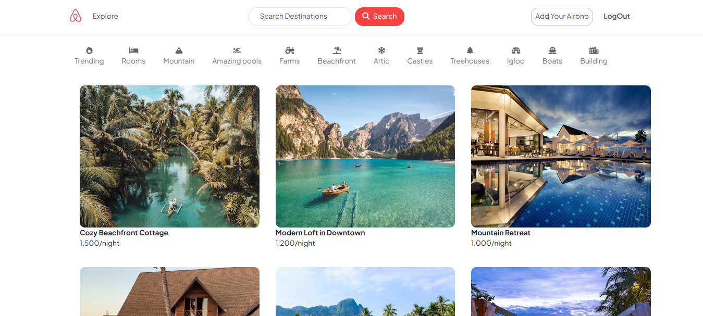
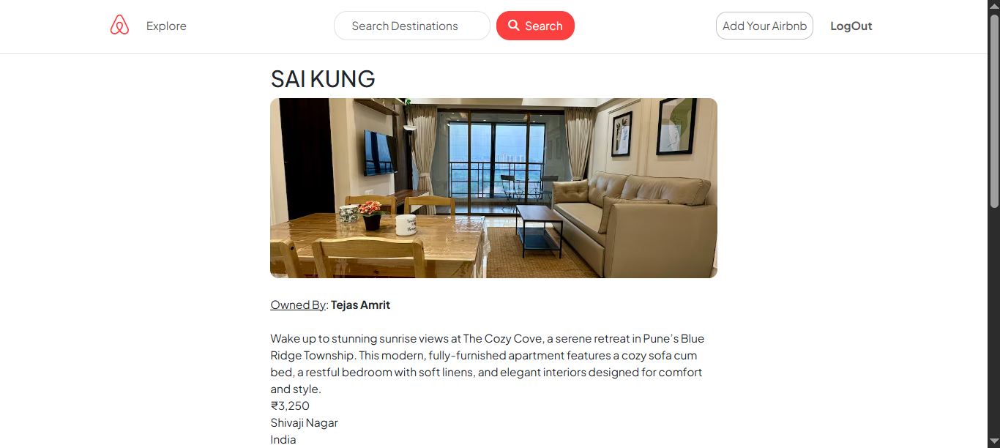

# 🏡 Airbnb Clone

A full-stack clone of Airbnb, built using modern web technologies. This project replicates the core features of Airbnb like listing properties, user authentication, search, and responsive UI.

## 🚀 Live Demo

👉 [Live Site](https://airbnb-clone-25gc.onrender.com)

---

## 🛠️ Tech Stack

- **Frontend:** EJS, HTML5, CSS3, Bootstrap, Font Awesome
- **Backend:** Node.js, Express.js
- **Database:** MongoDB, Mongoose
- **Authentication:** Passport.js
- **File Uploads:** Multer, Cloudinary
- **Deployment:** Render (backend), GitHub

---

## ✨ Features

- ✅ User registration & login with session-based auth
- ✅ Create, read, update & delete (CRUD) listings
- ✅ Upload listing images to Cloudinary
- ✅ Search listings by title and location
- ✅ Filter listings with UI icons (e.g., mountain, pool)
- ✅ Responsive design for mobile & desktop
- ✅ Error handling and flash messages
- ✅ Secure route protection with middleware
- ✅ Pretty UI using Bootstrap cards and layout

---

## 📸 Screenshots

### Home Page


### Listing Page



## 📁 Folder Structure

```
Airbnb_Clone/
├── models/
├── routes/
├── controllers/
├── views/
├── public/
├── middleware/
├── utils/
├── cloudConfig.js
├── app.js
├── package.json
└── README.md
```

---

## 💡 Additional Info

- Built with MVC architecture for scalability
- Custom error handling using Express middleware
- Codebase follows best practices for readability and maintainability
- You can extend this project by adding:
  - Booking system with date selection
  - Reviews & ratings
  - Payment gateway integration

---

## 📬 Feedback

If you like this project, feel free to ⭐ the repo and connect with me on [LinkedIn](https://www.linkedin.com/in/tejas-amrit-0104b9227/)  
Contributions are welcome!
